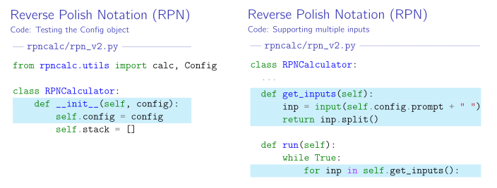

# LaTeX Minted extract

## Introduction

This project lets you use comment annotations inside code files, in order to
select snippets to use for [minted](https://github.com/gpoore/minted).

It also lets you use such annotations to select lines to be highlighted. The end
result is having snippets controlled by code comments, rather than needing to
provide line numbers to minted.

## Example

Based on the following code:

```python
from rpncalc.utils import calc, Config  # <- config-1

class RPNCalculator:
    def __init__(self, config):  # <! config-1
        self.config = config  # !> config-1
        self.stack = []  # -> config-1

    def get_inputs(self):  # <- multi-input; <! multi-input
        inp = input(self.config.prompt + " ")
        return inp.split()  # !> multi-input

    def run(self):
        while True:
            for inp in self.get_inputs():  # !! multi-input; -> multi-input
                ...
```

these slides were generated:



## Usage

The following comments are currently recognized:

- `# <- NAME`: Start a snippet named `NAME`
- `# -> NAME`: End a snippet named `NAME`
- `# <! NAME`: Start highlighting for a snippet named `NAME`
- `# !> NAME`: End highlighting for a snippet named `NAME`
- `# !! NAME`: Highlight this line for a snippet named `NAME`

Those directives can be combined by `;`, e.g. `# <- part-2; !! part-2` to start
a snippet with the first line highlighted.

Snippet names can contain `[...]` patterns, e.g. `# -> part-[123]` ends
`part-1`, `part-2` and `part-3`. Note that ranges (`part[1-3]`) are not
supported, though a PR to add support would be appreciated!

To integrate this into your LaTeX project, add something like this to the
preamble:

```latex
\usepackage{keycommand}
\newkeycommand{\inputmintedex}[opts=,lang=python,bool showname=false][2]{%
    \input|"python scripts/minted_extract.py --minted-opts '\commandkey{opts}' --minted-lang '\commandkey{lang}' --show-name '\commandkey{showname}' '#1' '#2'"%
}
```

You will also need to define a `\filenameheader` command to specify how filenames should get printed when using `showname`, e.g.:

```latex
\newcommand{\filenameheader}[1]{\texttt{\detokenize{#1}:}}
```

then finally, to include a snippet from a file, use:

```latex
\inputmintedex[...]{code/example.py}{part-1}
```

with the following options available inside `[...]`:

- `opts={...}`: Options passed on to minted, e.g. `opts={gobble=4}`
- `lang=...`: The language to use for highlighting
- `showname=true`: Add a `\filenameheader` command to show the filename

## Contributions

This tool was mostly written for myself, because I was tired adjusting lots of
line numbers every time I did a change for my
[company trainings](https://bruhin.software) around [pytest](https://pytest.org)
and Python. 

For the most part, the tool does what I want. I decided to release it in the
hope that others might find it useful. I do not, however, anticipate any bigger
changes going forward: I'm already quite busy as-is with the maintenance of
[qutebrowser](https://qutebrowser.org) and [pytest](https://pytest.org).

Before opening a pull request that isn't just a trivial bugfix of some sorts,
consider opening an issue and describing your improvement idea first. If it's a
poor fit for how I use this tool, or if it's a bigger maintenance burden for
something I wouldn't use myself, I reserve the right to say no. By opening an
issue first, you'll avoid spending lots of effort on something I might end up
not being willing to accept.
